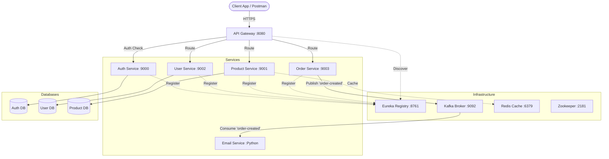
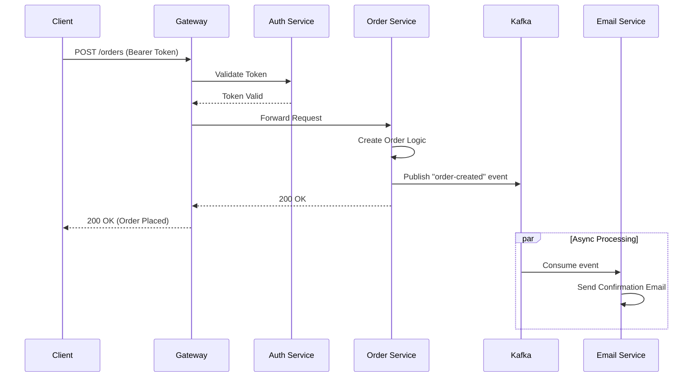

# Microservices E-Commerce Demo

> **Portfolio Project**: A comprehensive demonstration of a modern, event-driven microservices architecture using Spring Boot, Kafka, Docker, and Kubernetes-ready patterns.


## 📑 Quick Links
- [Project Overview](#-project-overview)
- [Architecture](#-architecture)
- [Tech Stack](#-tech-stack)
- [Getting Started](#-getting-started)
- [API Reference](#-api-reference)

---

## 📖 Project Overview

This repository demonstrates a robust e-commerce backend built with **Spring Boot** microservices. It showcases industry-standard patterns including **Service Discovery** (Eureka), **API Gateway** (Spring Cloud Gateway), **Centralized Authentication** (JWT), **Event-Driven Architecture** (Kafka), and **Distributed Caching** (Redis).

The system handles core e-commerce flows: user registration/auth, product management, order placement, and asynchronous email notifications.

### Key Features
*   **Microservices Architecture**: Decoupled services for scalability and independent deployment.
*   **Event-Driven**: Asynchronous communication between Order and Email services using Kafka.
*   **Secure**: Centralized JWT authentication and authorization at the Gateway and Service level.
*   **Resilient**: Circuit breaking and service discovery integration.
*   **Containerized**: Fully Dockerized setup with `docker-compose` for easy local orchestration.
*   **Developer Experience**: Integrated `spring-dotenv` for seamless local configuration management.

---

## 🏗️ Architecture

### High-Level Components



### Request Flow (Order Placement)



---

## 🛠️ Tech Stack

| Category | Technology | Usage |
|----------|------------|-------|
| **Framework** | Spring Boot 3.5.6 | Core framework for all Java services |
| **Language** | Java 17 | Primary backend language |
| **Language** | Python 3 | Email service consumer |
| **Discovery** | Netflix Eureka | Service registration and discovery |
| **Gateway** | Spring Cloud Gateway | Entry point, routing, and auth validation |
| **Database** | PostgreSQL 18 | Relational data storage (per-service DBs) |
| **Messaging** | Apache Kafka | Asynchronous event streaming |
| **Caching** | Redis | Distributed caching for products |
| **Security** | Spring Security + JWT | Stateless authentication |
| **Build** | Maven | Dependency management |
| **Container** | Docker & Docker Compose | Containerization and orchestration |

---

## 🚀 Getting Started

### Prerequisites
*   [Docker Desktop](https://www.docker.com/products/docker-desktop)
*   [Java 17+](https://www.oracle.com/java/technologies/javase/jdk17-archive-downloads.html) (for local dev)
*   [Maven](https://maven.apache.org/download.cgi)

### 1. Configuration Setup
This project uses `.env` files for configuration. You must set these up before running the application.

1.  **Root Configuration**:
    ```bash
    cp .env.sample .env
    ```
    *This file contains global versions and database credentials.*

2.  **Service Configurations**:
    Navigate to each service directory and create the `.env` file from the sample. This is required for both Docker and local execution (via `spring-dotenv`).
    ```bash
    # Run this for: api-gateway, auth-service, user-service, product-service, order-service, email-service
    cp <service-dir>/.env.sample <service-dir>/.env
    ```

3.  **Security Configuration (Critical)**:
    *   Generate a strong Base64 secret key (you can use [this tool](https://generate.plus/en/base64)).
    *   Update the `JWT_SECRET` variable in **both** `api-gateway/.env` and `auth-service/.env`.
    *   ⚠️ **They must match!**

### 2. Run with Docker (Recommended)
The easiest way to run the entire system.

1.  **Build and Start**:
    ```bash
    docker-compose up -d --build
    ```
    *This starts Postgres, Kafka, Zookeeper, Redis, Mailhog, and all microservices.*

2.  **Verify Services**:
    *   **Eureka Dashboard**: [http://localhost:8761](http://localhost:8761)
    *   **Mailhog (Email Test)**: [http://localhost:8025](http://localhost:8025)
    *   **API Gateway**: [http://localhost:8080](http://localhost:8080)

3.  **Stop**:
    ```bash
    docker-compose down
    ```

### 3. Local Development (Hybrid)
To run a specific service (e.g., `product-service`) locally while keeping infrastructure in Docker:

1.  **Start Infrastructure Only**:
    ```bash
    cd devops/dev
    docker-compose up -d
    ```
    *Starts Kafka, Redis, Zookeeper, Mailhog, and Databases.*

2.  **Run Service**:
    ```bash
    cd product-service
    mvn spring-boot:run
    ```
    *The service will automatically load variables from its local `.env` file.*

---

## 🔌 API Reference

### 🛡️ Auth Service
**Base URL**: `http://localhost:8080/auth`

| Method | Endpoint | Description | Auth Required |
| :--- | :--- | :--- | :--- |
| `POST` | `/token` | Authenticate and get JWT. Requires Basic Auth header. | No |
| `POST` | `/register` | Register a new admin user. | No |

**Example: Register Admin**
```bash
curl -X POST http://localhost:8080/auth/register \
  -H "Content-Type: application/json" \
  -d '{
    "username": "admin",
    "password": "password123"
  }'
```

### 👤 User Service
**Base URL**: `http://localhost:8080/users`

| Method | Endpoint | Description |
| :--- | :--- | :--- |
| `GET` | `/` | Get all users |
| `GET` | `/{id}` | Get user by ID |
| `POST` | `/` | Create a new user |
| `PUT` | `/{id}` | Update a user |
| `DELETE` | `/{id}` | Delete a user |

**Example: Create User**
```bash
curl -X POST http://localhost:8080/users \
  -H "Authorization: Bearer <YOUR_JWT>" \
  -H "Content-Type: application/json" \
  -d '{
    "name": "John Doe",
    "email": "john@example.com"
  }'
```

### 📦 Product Service
**Base URL**: `http://localhost:8080/products`

| Method | Endpoint | Description |
| :--- | :--- | :--- |
| `GET` | `/` | List all products |
| `GET` | `/{id}` | Get product details |
| `POST` | `/` | Create a product |
| `PATCH` | `/{id}` | Update a product |
| `DELETE` | `/{id}` | Delete a product |

**Example: Create Product**
```bash
curl -X POST http://localhost:8080/products \
  -H "Authorization: Bearer <YOUR_JWT>" \
  -H "Content-Type: application/json" \
  -d '{
    "name": "Laptop",
    "description": "High performance laptop",
    "price": 1200.00,
    "quantity": 10
  }'
```

### 🛒 Order Service
**Base URL**: `http://localhost:8080/orders`

| Method | Endpoint | Description |
| :--- | :--- | :--- |
| `POST` | `/` | Place a new order |

**Example: Place Order**
```bash
curl -X POST http://localhost:8080/orders \
  -H "Authorization: Bearer <YOUR_JWT>" \
  -H "Content-Type: application/json" \
  -d '{
    "productId": "prod-123",
    "userId": "user-456",
    "quantity": 1
  }'
```

---

## 📊 Observability & Monitoring

*   **Distributed Tracing**: Currently, logs are aggregated per container. Use `docker-compose logs -f <service_name>` to tail logs.
*   **Mailhog**: Used to capture emails sent by the Email Service. Access the UI at `http://localhost:8025`.
*   **Health Checks**: All services expose Spring Boot Actuator health endpoints (e.g., `/actuator/health`).

---

## 🔒 Security

*   **JWT Authentication**: The `auth-service` issues tokens signed with a secret key.
*   **Gateway Validation**: The `api-gateway` validates the signature of incoming requests before routing.
*   **Secret Management**: Secrets are managed via `.env` files.
    *   *Remediation Note*: For production, use a secret manager (Vault, AWS Secrets Manager) instead of `.env` files.

---

## 📂 Data Model

*   **User DB**: Stores user profiles and credentials.
*   **Product DB**: Stores product catalog (Name, Price, Description, Stock).
*   **Auth DB**: Stores admin/auth specific data.
*   **Migrations**: Database schemas are managed via Hibernate `update` (auto-ddl).

---

## 🤝 Contributing

See [CONTRIBUTING.md](CONTRIBUTING.md) for details on code style and pull request process.

## ❓ Troubleshooting

See [TROUBLESHOOTING.md](TROUBLESHOOTING.md) for common issues like port conflicts or Docker errors.
